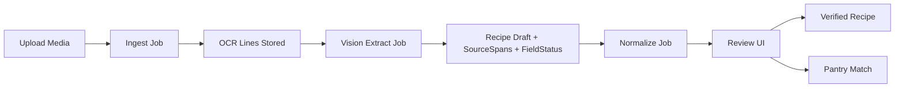

# Implementation Plan (Coder)

## Goals
- Implement RecipeNow V1 per `docs/SPEC.md`: ingest recipe media, OCR + vision-primary extraction (OpenAI), provenance-first review UI, pantry matching, and verification.
- Ship an end-to-end flow that keeps provenance for every extracted field and flags user-entered edits.
- Provide a self-hosted stack (FastAPI + Postgres + Next.js) with worker jobs for OCR/vision extract/normalize.

## Non-goals
- Public sharing/community features.
- URL auto-import unless user uploads media.
- Perfect nutrition/macros unless explicitly marked estimated and user-approved.
- Full automatic unit conversion beyond a basic servings multiplier.

## Constraints & Invariants
- Do not delete working code. Preserve existing scaffolding and stubs in `apps/`, `packages/`, and `infra/`.
- Source-of-truth only: no field becomes "fact" unless OCR + span or explicitly user-entered.
- No silent inference: missing/ambiguous values become questions or missing fields.
- Every field must carry `FieldStatus`; non-extracted fields must show badges.
- Verification requires title, >= 1 ingredient, >= 1 step; missing times/servings keep `needs_review` unless user confirms "unknown."
- Vision extraction must reference OCR line evidence; do not invent quantities/units.
- Privacy: keep assets private; no sharing in V1.
- API must match V1 endpoints in `docs/SPEC.md`.

## Architecture
- Services: FastAPI API, worker (OCR/parse/normalize), Postgres, optional MinIO.
- App layers: `packages/schema` (shared models), `packages/ocr` (OCR adapters), `packages/parser` (structuring + provenance), `packages/matcher` (pantry matching).
- UI: Next.js app with Library, Review (split view), Pantry, Match, Cook Mode.

Mermaid

## Data flow & interfaces
- Ingest: `POST /assets/upload` stores media, triggers OCR job.
- OCR: generates OCR lines/tokens with bbox + confidence; persisted by asset/page.
- Extract: vision-primary extraction using image + OCR lines, produces Recipe draft + SourceSpans + FieldStatus.
- Normalize: computes `name_norm` and ingredient tags without altering `original_text`.
- Review: user edits update field values + set `FieldStatus` to `user_entered` and update/clear spans.

FastAPI guidance (Context7)
- Use `APIRouter` modules per resource and include them in the main app for clean, tagged OpenAPI routing.
- Use `BackgroundTasks` only for short, post-response work; heavier OCR/parse should go to the worker queue.

Next.js guidance (Context7)
- Use the App Router `app/` directory with `layout.js` and `page.js` for routes.
- Use `app/api/.../route.js` only for UI-adjacent endpoints; core API stays in FastAPI.

## Context7 Library Decisions (Resolved for Sprint 0)

All library versions resolved via Context7 MCP tool on 2026-01-09:

| Technology | Version | Decision | Rationale |
|-----------|---------|----------|-----------|
| **FastAPI** | 0.128.0 | Finalized | Native async/await, Pydantic validation, excellent OCR pipeline performance |
| **Next.js** | 16.1.0 | Finalized (App Router) | Turbopack stable, optimized images for recipe photos, Server Components for data fetching |
| **PostgreSQL Driver** | psycopg 3.3.2 | Finalized | Native async/await support, async connection pooling essential for high-concurrency OCR jobs |
| **Job Queue** | ARQ 0.26.3 | Finalized | 7-40x faster than RQ, native async/await, seamless FastAPI integration, perfect for I/O-bound OCR |
| **OCR Library** | PaddleOCR 3.3.2 | Finalized | Superior accuracy for recipes, GPU support, active maintenance, 80+ languages |
| **Redis** | 7.x (alpine) | Finalized | Required for ARQ job queue, lightweight Docker image |

### Build Configuration Files (Sprint 0 Complete)
- `apps/api/requirements.txt` — FastAPI 0.128.0, psycopg[binary,pool] 3.3.2, arq 0.26.3, paddleocr[all] 3.3.2
- `apps/api/Dockerfile` — Multi-stage build, optimized for FastAPI + OCR dependencies
- `apps/web/package.json` — Next.js 16.1.0, React 19.0.0, TypeScript, TailwindCSS
- `apps/web/Dockerfile` — Multi-stage Next.js build, production-optimized
- `apps/worker/requirements.txt` — Shared dependencies (arq, psycopg, paddleocr)
- `apps/worker/Dockerfile` — ARQ worker for background jobs
- `infra/docker-compose.yml` — Updated with postgres, redis, api, web, worker, minio services

Endpoints (V1)
- Assets: `POST /assets/upload`, `GET /assets/{id}`, `POST /assets/{id}/ocr`, `POST /assets/{id}/extract`
- Recipes: `GET /recipes`, `POST /recipes`, `GET /recipes/{id}`, `PATCH /recipes/{id}`, `POST /recipes/{id}/verify`
- Spans: `POST /recipes/{id}/spans`, `GET /recipes/{id}/spans`
- Pantry: `GET /pantry`, `POST /pantry/items`, `DELETE /pantry/items/{id}`
- Match: `POST /match`, `POST /shopping-list/from-match`

## Phases & Sprint Plan (tickets + acceptance criteria)

Sprint 0: Align scaffolding and dependencies
- Ticket: Confirm repo layout and stubs in `apps/`, `packages/`, `infra/` remain intact; add minimal package configs without removing files.
  - AC: No deletions of existing files; repo layout matches `docs/Repo_Structure.md`.
- Ticket: Establish FastAPI app wiring using `APIRouter` modules and a health route.
  - AC: `apps/api/main.py` includes routers for assets/recipes/pantry/match/shopping-list and returns `{\"status\": \"ok\"}` at `/`.
- Ticket: Decide Next.js App Router as the frontend structure and add minimal `app/layout` + `app/page` placeholders.
  - AC: `apps/web` contains App Router placeholders for root layout/page without adding API routes.
- Ticket: Add baseline configs for running services locally (requirements/pyproject for API, package.json for web) without removing existing files.
  - AC: Minimal config files exist and do not conflict with current stubs.

Sprint 1: Schema + persistence
- Ticket: Define Pydantic + TS schema in `packages/schema` for Recipe, SourceSpan, FieldStatus, MediaAsset, OCRLine, PantryItem.
  - AC: Schema matches `docs/SPEC.md` data model; fields include `field_path`, `bbox`, `status`.
- Ticket: Create DB models and migrations for core entities.
  - AC: Postgres migration creates tables; CRUD tests for Recipe + SourceSpan pass.

Sprint 2: Ingest + OCR pipeline
- Ticket: Implement `/assets/upload` with storage to disk/MinIO and create MediaAsset records.
  - AC: Upload returns `asset_id` and stores file successfully.
- Ticket: Implement OCR job with stored OCR lines and `POST /assets/{id}/ocr` to enqueue.
  - AC: OCR job populates OCR lines linked to asset.

Sprint 3: Structure + Normalize
- Ticket: Implement structure job that creates Recipe draft, SourceSpans, FieldStatus.
  - AC: Parsed title/ingredients/steps are stored with spans and field statuses.
- Ticket: Implement normalize job with `name_norm` and tags.
  - AC: `name_norm` is set without altering `original_text`, and is marked derived.

Sprint 4: Review UI
- Ticket: Build split view review UI: image viewer + editable fields with badges.
  - AC: Clicking a field highlights bbox; editing flips status to user-entered.
- Ticket: Verification workflow.
  - AC: Verify button gated by required fields; missing times/servings require explicit "unknown."

Sprint 5: Pantry + Match
- Ticket: Pantry CRUD endpoints and UI.
  - AC: Pantry list + quick add works with normalized names.
- Ticket: Match endpoint and UI results.
  - AC: Match percent and missing lists are correct; shopping list can be generated.

## Risks & Open Questions
- OCR quality: need fallback "re-run OCR with different settings" + manual correction.
- Layout complexity: multi-column pages require region selection or layout heuristics.
- Background job system: choose Celery/RQ/Arq and define job state tracking.
- Next.js router choice: App Router vs Pages Router (confirm before finalizing).
- Auth: clarify single-user vs local accounts; impacts session/JWT implementation.

## Handoff (Coder)
- Preserve existing scaffolding and do not delete working files; extend in place.
- Implement schemas and DB models aligned to `docs/SPEC.md` (MediaAsset, OCRLine, Recipe, SourceSpan, FieldStatus, PantryItem).
- Keep provenance rules strict: no inferred values without OCR evidence; edits must flip `FieldStatus` and update spans.
- Use FastAPI `APIRouter` modules for assets/recipes/pantry/match; background tasks only for short work, real OCR/parse in worker queue.
- Build the split-view review UI with field highlight/badge behavior and verification gating.
- Implement pantry normalization and match scoring rules exactly as in spec.
