# SPEC.md — RecipeNow V1.1 (Vision-Primary)

**Canonical source of truth. Supersedes prior SPEC.md + SPEC_UPDATES_old.md.**

---

## Goals

- Convert uploaded recipe media (photos/screenshots/PDF pages) into a canonical recipe with field-level provenance traceable back to source pixels.
- Use the OpenAI Vision API as the **primary extractor** for messy layouts.
- Provide a split-view Review UI where users can verify/override fields and see extraction source badges.
- Produce a standardized Recipe Card output (for UI and export) with a hero image crop from source media.

## Non-Goals (V1.1)

- Public sharing/community features.
- Perfect nutrition/macros (allowed only as explicitly "estimated" + user-approved).
- Fully automatic unit conversion beyond a simple servings multiplier.
- Generating new food images (hero image is sourced/cropped from uploaded media).

## Constraints & Invariants (NON-NEGOTIABLE)

1) **Source-of-truth extraction**
   - Extracted fields must be supported by visible content in the uploaded media.
   - The vision LLM is treated as a reader, not a creative writer.
   - It may reorder/structure text, but must not invent missing ingredients/steps/times.

2) **Provenance per field (required)**
   - Every extracted field has provenance via one or more SourceSpans.
   - Because hosted vision APIs generally do not return bounding boxes, **OCR runs in parallel** to supply bboxes, and the LLM output must reference OCR line IDs as evidence.

3) **No silent inference**
   - If a value is not visible or ambiguous, it must be missing or ambiguous with an explicit badge.
   - Portion/servings estimate is allowed only as a derived field: stored as servings_estimate, flagged as estimated, and requires user confirmation to become servings.

4) **User is final editor**
   - Review UI edits flip FieldStatus to user_entered and clear/replace provenance.

5) **Verification gating**
   - Title + ≥1 ingredient + ≥1 step required to mark verified.
   - If servings/time is missing, user must explicitly confirm "unknown" or accept an estimate.

6) **Hosted vision only**
   - OpenAI Vision API only; no local/self-hosted LLMs.

---

## Architecture

### High-Level Flow (V1.1)

```mermaid
graph LR
  A["Upload Media<br/>(image/PDF page)"] --> B["Ingest Job<br/>Store + preprocess + OCR"]
  B --> C["OCRLines<br/>bbox + confidence"]
  C --> D["Vision-API Extract Job<br/>(OpenAI Vision)<br/>image + OCRLines"]
  D --> E["Recipe Draft<br/>+ SourceSpans<br/>+ FieldStatus"]
  E --> F["Normalize Job<br/>name_norm + tags"]
  F --> G["Recipe Card Build<br/>hero crop + card JSON"]
  G --> H["Review UI<br/>split-view + badges"]
  H --> I{Status}
  I -->|needs_review| H
  I -->|verified| J["Library + Pantry Match (optional)"]
```



### Services

- API: FastAPI (or existing backend) exposes upload/extract/review endpoints.
- Worker: background jobs (ingest/OCR/extract/normalize/card build).
- DB: Postgres.
- Web: Next.js review UI (split view).

---

## Data Model (V1.1)

### MediaAsset
Unchanged from prior spec.

### OCRLine
Unchanged from prior spec; required to generate bounding-box provenance.

### Recipe (updated for explicit estimates)
```
Recipe:
  id: UUID
  title: string
  servings: int|null                # explicit, source-backed OR user-confirmed
  servings_estimate:                # derived only; never silently promoted
    value: int|null
    confidence: float|null
    basis: string|null              # e.g., "LLM estimate from ingredient quantities"
    approved_by_user: bool
  times: { prep_min?, cook_min?, total_min? }
  ingredients: [{ id, original_text, name_norm?, quantity?, unit?, optional }]
  steps: [{ id, text }]
  tags: [string]
  status: draft|needs_review|verified
  created_at, updated_at
```

### RecipeCard (new)
```
RecipeCard:
  id: UUID
  recipe_id: UUID
  hero_image:
    asset_id: UUID
    page: int
    crop_bbox: {x,y,w,h} | null     # user-adjustable; null = full image
  title: string
  servings_display: string          # e.g., "Serves 4" or "Estimated: 3–4"
  ingredients: [string]             # formatted for display
  steps: [string]
  generated_at: DateTime
```

### SourceSpan (updated)
```
SourceSpan:
  id: UUID
  recipe_id: UUID
  field_path: string
  asset_id: UUID
  page: int
  bbox: {x,y,w,h}
  ocr_confidence: float
  extracted_text: string
  source_method: "ocr" | "vision-api" | "user"
  evidence:
    ocr_line_ids: [UUID]            # required for vision-api spans
```

### FieldStatus
Keep prior statuses plus optional ambiguous.

---

## Pipeline & Jobs (V1.1)

### Job 1: Ingest + OCR (required)
- Store asset, preprocess (rotate/deskew as needed), run OCR to create OCRLines with bbox.

### Job 2: Vision-API Extract (primary)
Input: original image/PDF page + OCRLines
Output: Recipe draft + SourceSpans + FieldStatus

**Vision-API contract (strict JSON):**
```
{
  "title": { "text": "...", "evidence_ocr_line_ids": ["..."], "confidence": 0.0 },
  "ingredients": [
    { "text": "...", "evidence_ocr_line_ids": ["..."], "confidence": 0.0 }
  ],
  "steps": [
    { "text": "...", "evidence_ocr_line_ids": ["..."], "confidence": 0.0 }
  ],
  "servings": { "value": 4, "evidence_ocr_line_ids": ["..."], "confidence": 0.0, "is_estimate": false },
  "servings_estimate": { "value": 4, "confidence": 0.0, "basis": "...", "is_estimate": true },
  "times": {
    "prep_min": { "value": 10, "evidence_ocr_line_ids": ["..."], "confidence": 0.0 },
    "cook_min": { "value": 20, "evidence_ocr_line_ids": ["..."], "confidence": 0.0 }
  },
  "unreadable_regions": [{ "note": "..."}]
}
```

**Rules:**
- If not visible, output null and/or add to unreadable_regions.
- For each extracted field, include evidence_ocr_line_ids.
- Estimates must be explicitly marked and never overwrite explicit servings.

**SourceSpan creation:**
- Union bboxes of referenced OCR lines → SourceSpan.bbox.
- source_method="vision-api" for these spans.

### Job 3: Normalize (unchanged)
- Compute name_norm from original_text without altering it.

### Job 4: Recipe Card Build (new)
- Default hero crop = full image (or largest photo region if heuristic implemented later).
- User can adjust crop in UI; persist crop_bbox.
- Render RecipeCard from canonical recipe.

---

## Review UI (V1.1)

### Split View
- Left: image/PDF viewer with bbox overlays (from SourceSpans).
- Right: editable recipe + card preview panel.

### Badges
- Vision API (primary extraction)
- OCR (if any OCR-only extraction remains)
- User Entered
- Missing/Ambiguous

### Servings / portion UX
- If explicit servings extracted: show as normal.
- If only estimate exists: show "Estimated: X" with Approve toggle.
  - Approve → copies estimate into servings and sets approved_by_user=true.
  - Decline → keep as unknown.

---

## API (REST, V1.1)

### Assets
- POST /assets/upload → {asset_id} (enqueue ingest/OCR)
- GET /assets/{id} → file blob

### Extraction
- POST /assets/{id}/extract → {job_id} (runs Vision-API Extract; requires OCRLines present)
- GET /jobs/{id} → status/result pointers

### Recipes
- GET /recipes?...
- GET /recipes/{id} → recipe + FieldStatuses + SourceSpans
- PATCH /recipes/{id} → edits update FieldStatus + provenance rules
- POST /recipes/{id}/verify → gating rules

### Recipe Cards
- GET /recipes/{id}/card → RecipeCard
- PATCH /recipes/{id}/card → update hero crop bbox

---

## Configuration (V1.1)

```
OPENAI_API_KEY=...
VISION_MODEL=...
VISION_MAX_OUTPUT_TOKENS=...
VISION_STRICT_JSON=true
VISION_RETRY_COUNT=2
OCR_ENABLED=true (recommended always-on for provenance)
```

Privacy knob:
- STORE_SOURCE_MEDIA=true|false (if false, only keep derived + low-res preview; provenance will be limited)

---

## Acceptance Criteria (End-to-End)

- Upload a recipe photo → system produces: title, ≥1 ingredient, ≥1 step in draft.
- Source badges visible per field; clicking field highlights a bbox region on media (via OCR-backed evidence).
- Recipe Card exists for every recipe: hero image from source media, standardized layout, servings explicit or clearly labeled estimate.
- Verification gating enforced: title + ≥1 ingredient + ≥1 step required; estimated servings require user approval.
