# SPEC.md — RecipeNow V1 Implementation Blueprint

**Canonical Source of Truth for all development. All other docs derive from this.**

---

## Goals

- Convert uploaded recipe media (screenshots/photos/PDF pages) into **canonical recipes** where every extracted field is traceable back to the source pixels via **provenance spans**.
- Provide a fast, intuitive **split-view review UI** to inspect, correct, and verify extracted data.
- Match recipes against a **pantry inventory** to suggest "what can I cook?" with ingredient coverage %.
- Ship a **self-hosted, privacy-first stack** (FastAPI + Postgres + Next.js + Docker Compose).

---

## Non-Goals (V1)

- Public sharing / community features.
- Auto-importing recipes by URL (unless user uploads a screenshot/PDF themselves).
- Perfect nutrition / macros (allowed only as explicit "estimated" + user-approved).
- Fully automatic unit conversion / scaling beyond a basic servings multiplier.
- Deployment to cloud (self-hosted only in V1).

---

## Constraints & Invariants (NON-NEGOTIABLE)

1. **Source-of-truth only:** All extracted data must come from the uploaded media. No inference or guessing values not visible in media.
   - OCR extraction (PaddleOCR + preprocessing): primary method.
   - Vision LLM fallback (Ollama + LLaVA): secondary method (same media, better reader). LLM extracts **only visible text**, not inferred values.
2. **No silent inference:** Missing or ambiguous values become explicit questions or missing-field badges, not hidden assumptions.
3. **Provenance per field:** Every extracted field carries one or more `SourceSpan` records (asset_id + bbox + confidence + extracted_text + source_method).
   - Source method: `"ocr"` or `"llm-vision"` (both read visible media; LLM used only when OCR fails).
4. **User is final editor:** The Review UI is the primary workflow, not an "advanced option." Edits must flip `FieldStatus` and update/clear provenance.
5. **Verification gating:** Title + ≥1 ingredient + ≥1 step required. Missing times/servings keep `needs_review` unless user explicitly confirms "unknown."
6. **Parsing rules:**
   - Parser may only use text extracted from media (OCR or LLM vision); do not invent quantities, units, or ingredients.
   - If multiple candidates exist (e.g., two cooking temperatures), mark ambiguous → missing + create question.
   - `original_text` in ingredients is immutable; derived fields (`name_norm`, tags) can be overwritten by user.
7. **Privacy:** Keep all assets private; no sharing, federation, or export sharing in V1. Vision LLM fallback runs offline (Ollama) or air-gapped (no external API by default).
8. **API contracts:** Must match REST endpoints in "API (REST, V1)" section below.
9. **Backward compatibility:** Do not delete existing scaffolding in `apps/`, `packages/`, `infra/`, or `docs/`. Extend in place.

---

## Architecture

### High-Level Flow

```mermaid
graph LR
  A["Upload Media<br/>(image/PDF)"] --> B["Ingest Job<br/>Rotation Detection<br/>+ OCR"]
  B --> C["OCRLines stored<br/>with bbox + confidence<br/>+ source: ocr"]
  C --> D["Structure Job<br/>Deterministic Parse"]
  D --> E{Critical Fields<br/>Found?}
  E -->|Yes| F["Recipe Draft<br/>+ SourceSpans<br/>+ FieldStatus"]
  E -->|No| G["LLM Vision Fallback<br/>(Ollama + LLaVA)"]
  G --> H["Merge LLM Results<br/>(source: llm-vision)"]
  H --> F
  F --> I["Normalize Job<br/>name_norm + tags"]
  I --> J["Review UI<br/>Split view<br/>Source badges<br/>Edit + Verify"]
  J --> K{Status}
  K -->|Draft| J
  K -->|Verified| L["Pantry Match<br/>+ Shopping List"]
```



### Core Services & Layers

```
RecipeNow/
├── apps/
│   ├── api/              # FastAPI backend (keep existing structure + extend)
│   ├── web/              # Next.js frontend (keep App Router structure + extend)
│   └── worker/           # Background jobs (OCR/parse/normalize) — use Celery/RQ/Arq
├── packages/
│   ├── schema/           # Pydantic models + TS types (shared across services)
│   ├── ocr/              # OCR adapters + preprocessing
│   ├── parser/           # Structured extraction + SourceSpan writer
│   └── matcher/          # Pantry matching + scoring logic
├── infra/
│   ├── docker-compose.yml
│   └── migrations/       # Postgres schemas
└── docs/
    └── SPEC.md           # (this file — canonical)
```

---

## Data Model (V1)

### MediaAsset
```
id: UUID
type: enum(image, pdf)
sha256: String (content hash)
storage_path: String (local disk or MinIO path)
source_label: Optional[String] (e.g., "Cookbook photo", "Website screenshot")
created_at: DateTime
```

### OCRLine / OCRToken
```
id: UUID
asset_id: UUID
page: int (for PDFs; 0 for single images)
text: String
bbox: {x, y, w, h} in pixel coordinates (relative to original)
confidence: float [0..1]
created_at: DateTime
```

### Recipe
```
id: UUID
title: String
servings: Optional[int]
times: {
  prep_min: Optional[int],
  cook_min: Optional[int],
  total_min: Optional[int]
}
ingredients: [{
  id: UUID
  original_text: String (immutable; extracted from OCR or user-entered)
  name_norm: Optional[String] (derived; may be inferred or edited)
  quantity: Optional[float]
  unit: Optional[String]
  optional: bool
}]
steps: [{
  id: UUID
  text: String
}]
tags: [String] (meal type, cuisine, dietary flags)
nutrition: {
  calories: Optional[int]
  estimated: bool
  approved_by_user: bool
}
status: enum(draft, needs_review, verified)
created_at: DateTime
updated_at: DateTime
```

### SourceSpan
```
id: UUID
recipe_id: UUID
field_path: String (e.g., "title", "ingredients[2].original_text", "steps[0].text")
asset_id: UUID
page: int
bbox: {x, y, w, h}
ocr_confidence: float [0..1]
extracted_text: String (the actual OCR/LLM text that was extracted)
source_method: enum("ocr", "llm-vision")  # How this field was extracted
```

### FieldStatus
```
id: UUID
recipe_id: UUID
field_path: String
status: enum(missing, extracted, user_entered, verified)
notes: Optional[String]

Rule: If status != extracted, the UI must show a badge ("user entered" / "missing" / "verified").
```

### PantryItem
```
id: UUID
user_id: UUID (or NULL for single-user mode)
name_original: String (what user typed)
name_norm: String (normalized for matching)
quantity: Optional[float]
unit: Optional[String]
created_at: DateTime
```

---

## Pipeline & Jobs (V1)

### 1. Ingest Job
**Input:** Uploaded file (image or PDF page)
**Output:** MediaAsset stored + OCRLines created

**Steps:**
1. Store original file (local disk or MinIO).
2. **Preprocess** (new):
   - Detect image orientation using Tesseract with confidence voting (3 thresholding methods).
   - Auto-rotate image to correct orientation.
   - (Optional: deskew, contrast adjustment).
3. Run OCR (PaddleOCR) → generate OCRLines with bboxes + confidence.
4. Persist OCRLines linked to asset.
5. Log rotation correction for audit.

**Job trigger:** `POST /assets/upload` → enqueue ingest job.

**Rotation Detection Details:**
- Use Tesseract PSM 0 (orientation detection) with 3 thresholding methods (0, 1, 2).
- Filter results by confidence > 3.
- Majority vote on rotation (0°, 90°, 180°, 270°).
- Apply rotation via ImageMagick before OCR.
- Fallback: if no confident vote, proceed with original orientation.

### 2. Structure Job
**Input:** OCRLines for a given asset
**Output:** Recipe (draft) + SourceSpans + FieldStatus

**Rules:**
- Primary: Parser uses only OCR text; do NOT invent values.
- Fallback: If critical fields missing (title, or no ingredients, or no steps), trigger **LLM Vision fallback** (Ollama + LLaVA-7B).
  - LLM vision extracts structured recipe data from the **same media** (image).
  - LLM is a better visual reader; does not infer/guess values.
  - All LLM extractions marked with `source_method: "llm-vision"` in SourceSpans.
  - If LLM also fails, fields remain `status: missing`.
- If ambiguous (e.g., multiple temps), mark `status=missing` + create question note.

**LLM Vision Fallback Trigger:**
- After OCR parsing, count missing critical fields.
- If missing: title OR (no ingredients) OR (no steps) → invoke LLM fallback.
- LLM extracts: title, ingredients (with quantities/units), steps, times/servings.
- Merge LLM results into recipe (with LLM source attribution).

**Output fields:**
- **Title:** best guess from OCR or LLM + SourceSpan (if found).
- **Ingredients block:** detect block boundaries, extract lines, parse each as `{original_text, quantity?, unit?, optional?}` + SourceSpans.
- **Steps block:** detect block, extract numbered/bulleted lines + SourceSpans.
- **Times/Servings:** extract if explicitly present (look for keywords like "prep", "bake", "serves"); else missing.

**FieldStatus:** Set to `extracted` for found fields (mark source_method: ocr or llm-vision), `missing` for absent ones.

**Job trigger:** `POST /assets/{id}/structure` → enqueue structure job.

**LLM Vision Implementation (Offline-First):**
- Primary: Use Ollama + LLaVA-7B (offline, self-hosted, ~4.5 GB model).
- Fallback: Optional cloud API (Claude 3 Haiku or GPT-4-Vision) if Ollama unavailable and `LLM_FALLBACK_ENABLED=true`.
- All LLM results sourced as `"llm-vision"` in SourceSpans; user can see source in Review UI.

### 3. Normalize Job
**Input:** Recipe ingredients
**Output:** `name_norm` + ingredient tags (without altering `original_text`)

**Rules:**
- `original_text` is immutable.
- `name_norm` can be inferred/derived, but is editable by user.
- Do NOT invent quantities or units.
- Normalize to standard ingredient names (e.g., "eggs" vs "large eggs" → `name_norm: egg`).

**Job trigger:** Auto-run after Structure job; also available via `POST /recipes/{id}/normalize`.

---

## Review UI (V1)

### Main Screens

#### Library
- Recipe list with search bar.
- Filters: `status` (draft/needs_review/verified), `tags`, `source_label`.
- Sort: newest, verified-first, most-cooked (later).
- Quick actions: edit, delete, duplicate.

#### Recipe Review (Split View) — PRIMARY WORKFLOW
- **Left panel:** Image/PDF viewer with zoom, pan, crop tools.
- **Right panel:** Editable recipe form (title, servings, times, ingredients, steps, tags, nutrition).
- **Interaction:**
  - Clicking any field highlights the corresponding bbox on the left (if SourceSpan exists).
  - **Badge per field:** `OCR` (blue) / `LLM Vision` (purple) / `User Entered` (green) / `Missing` (red).
    - Badges show data source: OCR extraction, LLM Vision fallback, or user-edited.
  - Edit a field → badge flips to `User Entered`, SourceSpan is cleared or marked "edited".
  - Undo/redo for edits (optional, but nice).
- **Verify button:** Gated by validation (see "Validation Rules" below).

#### Pantry
- Pantry items list (name, optional quantity/unit).
- Quick-add with typeahead (fuzzy search against name_norm database).
- "What Can I Cook?" button → triggers match.

#### Recipe Match
- Shows match % (required ingredients covered).
- Lists missing required ingredients + optional ingredients.
- "Add to shopping list" button → generates exportable list.
- (Future: "Cook mode" with step-by-step checklist.)

---

## Validation Rules for "Verified"

A recipe may be marked `verified` only if:

1. **Title:** Present and non-empty.
2. **Ingredients:** ≥ 1 ingredient with non-empty `original_text`.
3. **Steps:** ≥ 1 step with non-empty text.
4. **Times/Servings:** If missing, user must explicitly confirm "unknown" (radio button). Else, keep `status=needs_review`.

**After verification:**
- `status` → `verified`.
- All fields become read-only (except future "edit in verified" mode, not in V1).

---

## OCR Enhancement & LLM Vision Fallback (V1)

### Motivation
Standard OCR (PaddleOCR) can fail due to:
- **Rotated/skewed images:** Recipe cards scanned at odd angles.
- **Poor image quality:** Low contrast, shadows, small text.
- **Complex layouts:** Multi-column, text overlapping images.

RecipeNow uses a **two-stage approach** to maximize extraction:

### Stage 1: Image Preprocessing + PaddleOCR
1. **Orientation Detection** (Tesseract + voting):
   - Tesseract PSM 0 with 3 thresholding methods (0, 1, 2).
   - Consensus voting on rotation (0°, 90°, 180°, 270°).
   - Apply rotation via ImageMagick.
   - Proven: Handles ~99% of rotation cases (Carl Pearson: 152/152 recipe cards).
   
2. **OCR Extraction** (PaddleOCR):
   - Extract text lines with bboxes and confidence scores.
   - Create OCRLines records.

3. **Deterministic Parsing**:
   - Use keyword heuristics to detect: title block, ingredients block, steps block.
   - Extract structured fields: title, ingredients, steps, times, servings.
   - Create Recipe + SourceSpans + FieldStatus records.

### Stage 2: LLM Vision Fallback (If OCR Insufficient)
**Trigger:** After deterministic parsing, if critical fields are missing:
- No title extracted, OR
- Zero ingredients extracted, OR
- Zero steps extracted.

**Action:**
- Invoke vision LLM (Ollama + LLaVA-7B offline, or cloud API if opted-in).
- LLM reads the **same image** and extracts structured recipe data.
- LLM is a better visual reader; not inferring/guessing values.
- All LLM extractions tagged as `source_method: "llm-vision"` in SourceSpans.

**Why This Respects Invariant 1 ("Source-of-Truth Only"):**
- Both OCR and LLM read **visible text from the uploaded media**.
- Neither infers or guesses values.
- LLM is just a better reader than PaddleOCR for certain image conditions.
- User always sees source: OCR, LLM-Vision, or manually entered.

### Configuration & Privacy
- **Offline-first:** Ollama + LLaVA-7B runs locally (4.5 GB model, downloads once).
- **Cloud opt-in:** Optional fallback to Claude 3 Haiku or GPT-4-Vision (configurable via `LLM_FALLBACK_ENABLED`, `LLM_FALLBACK_PROVIDER`).
- **Audit trail:** SourceSpans record which method extracted each field.
- **User control:** Review UI badges show field source; users can edit/clear any field.

### System Requirements
- **Tesseract:** `tesseract-ocr` system binary (for orientation detection).
- **ImageMagick:** `convert` command (for rotation).
- **Ollama + LLaVA (optional):** ~8 GB RAM, ~4.5 GB disk for model (offline extraction).
- **Cloud API key (optional):** `ANTHROPIC_API_KEY` or `OPENAI_API_KEY` if using cloud fallback.

### Metrics & Success Criteria
- ✅ 90%+ of recipes extract title + ≥1 ingredient + ≥1 step without manual intervention.
- ✅ Rotated images automatically corrected before OCR.
- ✅ LLM fallback triggers only when OCR insufficient; not default path.
- ✅ Every field shows source badge: "OCR", "LLM Vision", or "User Entered".
- ✅ Zero privacy regression: Ollama default, cloud APIs optional + logged.

---

## Pantry Matching Logic (V1)

### Normalization
- Normalize pantry items to `name_norm` (e.g., "2 cups flour" → `name_norm: flour`).
- Normalize recipe ingredients to `name_norm`.

### Matching
For each recipe ingredient:
- If `name_norm` exists, match against pantry `name_norm` set (exact or fuzzy match, TBD).
- Else, fallback to fuzzy match on `original_text`.
- Count matches.

### Scoring
- **Match %:** `(matched_required) / (total_required)` (ignore `optional=true` ingredients).
- Output: match %, missing required list, missing optional list.

---

## API (REST, V1)

### Auth (Simple)
- Local user accounts (username/password) or single-user mode (configurable).
- Session cookie or JWT token.
- All endpoints below require valid auth.

### Endpoints

#### Assets
- `POST /assets/upload` → `{asset_id, source_label?}` (multipart/form-data; enqueues ingest job)
- `GET /assets/{id}` → file blob (image/PDF)
- `POST /assets/{id}/ocr` → `{job_id}` (re-run OCR with optional settings override)
- `POST /assets/{id}/structure` → `{job_id}` (re-run structure job)

#### Recipes
- `GET /recipes?query=&status=draft|needs_review|verified&tags=&source_label=` → recipe list + pagination
- `POST /recipes` → `{id}` (rare; mostly created by structure job; useful for manual creation)
- `GET /recipes/{id}` → full recipe object + FieldStatuses + SourceSpans
- `PATCH /recipes/{id}` → updated recipe (must create/update FieldStatus records; see below)
- `POST /recipes/{id}/verify` → runs validation, sets status to verified if all pass
- `DELETE /recipes/{id}` → soft-delete (mark deleted_at)

#### Spans & Provenance
- `POST /recipes/{id}/spans` → `{id}` (create/update a SourceSpan for a field)
- `GET /recipes/{id}/spans` → list of all SourceSpans for recipe
- `DELETE /recipes/{id}/spans/{span_id}` → remove a span (when user clears provenance)

#### Pantry
- `GET /pantry` → list of pantry items
- `POST /pantry/items` → `{id}` (create item with name + optional quantity/unit)
- `PATCH /pantry/items/{id}` → updated item
- `DELETE /pantry/items/{id}` → remove item

#### Match & Shopping List
- `POST /match` → `{recipe_matches: [{recipe_id, match_percent, missing_required, missing_optional}]}` (body: `{recipe_ids?, pantry_items?}`)
- `POST /shopping-list/from-match` → `{items: [{name, quantity, unit, source_recipe_ids}]}` (body: match results)

---

## Context7 Library Resolution Rules (MANDATORY FOR CODER)

Before finalizing any library/framework-specific decision, **the Coder MUST:**

1. **Use `resolve-library-id`** to get the correct, current library identifier (e.g., "fastapi@0.100", "next@14", "psycopg3@3.1").
2. **Use `get-library-docs`** to pull current, version-specific documentation.
3. **Base recommendations on retrieved docs**, not training memory.

**Apply to:**
- FastAPI version, routing, dependency injection, background tasks.
- Next.js App Router vs Pages Router, file structure, API routes.
- PostgreSQL drivers (psycopg2 vs psycopg3).
- Job queue library (Celery vs RQ vs Arq).
- OCR library (PaddleOCR vs Tesseract).

**If Context7 tools are unavailable,** mark all decisions with `[CONTEXT7 ASSUMED]` and clearly state assumptions in the handoff notes.

---

## Backward Compatibility & Preservation Rules

### DO NOT DELETE
- Any file in `apps/`, `packages/`, `infra/`, or `docs/` that was created before this session.
- Existing schema stubs, API router skeletons, or migration files.
- If a file is incomplete or wrong, **edit it in place** rather than deleting and recreating.

### EXTEND IN PLACE
- Add DB session setup to existing `apps/api/db/` modules.
- Add repository classes in a new `apps/api/repositories/` module.
- Extend `packages/schema` with full model definitions.
- Add job definitions in `apps/worker/` without removing existing stubs.

### VERSION & DOCUMENT CHANGES
- Update `docs/SESSION_NOTES.md` with files touched and decisions made.
- Update `docs/NOW.md` to reflect completed tasks.
- If a major decision changes (e.g., job queue library), update `docs/PROJECT_CONTEXT.md` Change Log.

---

## Phases & Sprint Plan (Tickets + Acceptance Criteria)

### Sprint 0: Align Scaffolding & Dependencies
**Goal:** Confirm repo structure, establish build/run environment.

#### Ticket 0.1: Preserve and audit existing scaffolding
- **AC:** Review `apps/`, `packages/`, `infra/`, `docs/` to confirm all existing files remain.
- **AC:** No deletions; only additions or edits to extend existing stubs.

#### Ticket 0.2: Establish FastAPI app wiring with APIRouter modules
- **AC:** `apps/api/main.py` imports and includes routers for: assets, recipes, spans, pantry, match.
- **AC:** `GET /` returns `{"status": "ok", "version": "0.1"}`.
- **AC:** `GET /docs` (OpenAPI) displays all endpoints grouped by resource.

#### Ticket 0.3: Establish Next.js App Router entry point
- **AC:** `apps/web/app/layout.jsx` and `apps/web/app/page.jsx` exist.
- **AC:** App runs with `npm run dev` without errors.
- **AC:** No Next.js API routes (`app/api/`) created; core API remains in FastAPI.

#### Ticket 0.4: Add build/run configs with Context7 guidance
- **AC:** `apps/api/requirements.txt` or `pyproject.toml` lists FastAPI, Pydantic, SQLAlchemy, job queue (TBD).
- **AC:** `apps/web/package.json` lists Next.js, React, TailwindCSS (or preferred UI lib).
- **AC:** `docker-compose.yml` in `infra/` defines services: api, web, worker, postgres, and runs without errors.
- **AC:** All Context7 decisions (FastAPI version, Next.js router, job queue) are documented in `docs/IMPLEMENTATION_PLAN.md` with library IDs.

---

### Sprint 1: Schema & Persistence
**Goal:** Define canonical data models and create DB schema.

#### Ticket 1.1: Define Pydantic + TypeScript schema
- **AC:** `packages/schema/python/models.py` contains Pydantic models for: MediaAsset, OCRLine, Recipe, Ingredient, Step, SourceSpan, FieldStatus, PantryItem.
- **AC:** `packages/schema/ts/recipe.ts` contains equivalent TS interfaces.
- **AC:** Models include all fields from "Data Model (V1)" section; `field_path` and `status` are present.
- **AC:** No breaking changes to existing schema stubs.

#### Ticket 1.2: Create DB models and migrations
- **AC:** `apps/api/db/models.py` defines SQLAlchemy ORM classes (one per table).
- **AC:** `infra/migrations/001_init.sql` creates all tables with proper indexes (asset_id, recipe_id, field_path).
- **AC:** Migration is idempotent (can re-run without errors).
- **AC:** CRUD tests for Recipe and SourceSpan pass (e.g., insert, read, update, delete).

---

### Sprint 2: Ingest & OCR
**Goal:** Accept file uploads, detect orientation, and generate OCRLines.

#### Ticket 2.1: Implement file upload and MediaAsset creation
- **AC:** `POST /assets/upload` accepts multipart/form-data (file + optional source_label).
- **AC:** Returns `{asset_id, storage_path}`.
- **AC:** File is stored locally (or MinIO if configured) and MediaAsset record is created.
- **AC:** sha256 content hash is computed and stored.
- **AC:** Integration test: upload → verify file exists and asset record is in DB.

#### Ticket 2.2: Implement OCR job with orientation detection and enqueue mechanism
- **AC:** Ingest job (triggered by upload) **detects and corrects image orientation** using Tesseract + voting.
- **AC:** Applies rotation via ImageMagick if detected.
- **AC:** Calls OCR library (PaddleOCR per Context7).
- **AC:** OCRLines are created with bbox + confidence for each detected line/token.
- **AC:** `POST /assets/{id}/ocr` re-enqueues OCR with optional settings override.
- **AC:** Integration test: upload rotated image → ingest job corrects rotation → OCRLines extracted correctly.
- **AC:** Logs rotation detection and correction for audit trail.

---

### Sprint 3: Structure & Normalize
**Goal:** Parse OCRLines into Recipe drafts with provenance; add LLM vision fallback.

#### Ticket 3.1: Implement structure job (constrained parse + LLM vision fallback)
- **AC:** Structure job reads OCRLines for an asset.
- **AC:** Parser detects: title block, ingredients block, steps block.
- **AC:** For each field, create a Recipe record + SourceSpans (with `source_method: "ocr"`) + FieldStatus entries.
- **AC:** SourceSpans correctly reference OCRLines with bbox and confidence.
- **AC:** FieldStatus is set to `extracted` for found fields, `missing` for absent.
- **AC:** **If critical fields missing** (no title OR no ingredients OR no steps):
  - Trigger LLM vision fallback (Ollama + LLaVA-7B by default, cloud API if `LLM_FALLBACK_ENABLED=true`).
  - LLM reads the same image and extracts structured recipe data.
  - Merge LLM results into recipe (all LLM fields marked `source_method: "llm-vision"` in SourceSpans).
  - Log which fields were populated by LLM vs. OCR.
- **AC:** `POST /assets/{id}/structure` enqueues structure job.
- **AC:** Integration test: Poor OCR image → OCR yields no ingredients → LLM fallback extracts ingredients → Recipe populated with LLM-Vision source tags.

#### Ticket 3.2: Implement normalize job
- **AC:** Normalize job computes `name_norm` for each ingredient without altering `original_text`.
- **AC:** `name_norm` is marked as derived (not extracted).
- **AC:** Auto-run after structure job; also available via `POST /recipes/{id}/normalize`.
- **AC:** Test: ingredient "2 cups all-purpose flour" (OCR or LLM) → `name_norm: flour`, `original_text` unchanged.

---

### Sprint 4: Persistence & CRUD
**Goal:** Wire up database access and implement read/write endpoints.

#### Ticket 4.1: Implement DB session + repository layer
- **AC:** `apps/api/db/session.py` defines SQLAlchemy session factory and context managers.
- **AC:** `apps/api/repositories/` contains RecipeRepository, SourceSpanRepository, PantryRepository.
- **AC:** Repositories support: create, read, read_all (with filters), update, delete, list_by_field_path.
- **AC:** Integration tests for each repository.

#### Ticket 4.2: Implement Recipe CRUD endpoints
- **AC:** `GET /recipes?query=&status=&tags=` returns filtered list with pagination.
- **AC:** `GET /recipes/{id}` returns full recipe + FieldStatuses + SourceSpans (including `source_method: ocr or llm-vision`).
- **AC:** `PATCH /recipes/{id}` accepts field updates, creates/updates FieldStatus records, updates/clears SourceSpans.
- **AC:** `POST /recipes/{id}/verify` validates (title, ≥1 ingredient, ≥1 step) and sets status to verified if pass.
- **AC:** `DELETE /recipes/{id}` soft-deletes (sets deleted_at).
- **AC:** Integration test: PATCH a field → FieldStatus flips to user_entered, SourceSpan is cleared.

#### Ticket 4.3: Implement SourceSpan endpoints
- **AC:** `POST /recipes/{id}/spans` creates/updates a span for a field.
- **AC:** `GET /recipes/{id}/spans` lists all spans.
- **AC:** `DELETE /recipes/{id}/spans/{span_id}` removes a span.

---

### Sprint 5: Review UI (Next.js)
**Goal:** Build split-view UI for recipe review and verification.

#### Ticket 5.1: Build Library screen
- **AC:** Displays recipes with search bar, filters (status, tags), and sort options.
- **AC:** Click recipe → navigates to Review screen.
- **AC:** Responsive design (mobile-friendly).

#### Ticket 5.2: Build Recipe Review (split view)
- **AC:** Left: image/PDF viewer with zoom, pan, crop (use react-pdf or similar).
- **AC:** Right: editable form with fields for title, servings, times, ingredients (list), steps (list), tags, nutrition.
- **AC:** Clicking a field highlights bbox on the left (if SourceSpan exists).
- **AC:** **Badges per field:** `OCR` (blue), `LLM Vision` (purple), `User Entered` (green), `Missing` (red).
  - Badges display `source_method` from SourceSpans: "ocr" → "OCR", "llm-vision" → "LLM Vision", user edit → "User Entered".
- **AC:** Edit a field → API call to `PATCH /recipes/{id}`, badge updates to "User Entered", SourceSpan clears.
- **AC:** Verify button gated by validation; clicking runs `POST /recipes/{id}/verify`.
- **AC:** Integration test: upload → review → verify → recipe marked verified with source badges visible.

---

### Sprint 6: Pantry & Match
**Goal:** Implement pantry CRUD and recipe matching.

#### Ticket 6.1: Implement Pantry CRUD
- **AC:** `GET /pantry` returns items.
- **AC:** `POST /pantry/items` creates item (name + optional qty/unit).
- **AC:** Quick-add UI with typeahead (fuzzy search by name_norm).

#### Ticket 6.2: Implement match logic and endpoints
- **AC:** `POST /match` scores recipes against pantry items.
- **AC:** Returns: `{recipe_matches: [{recipe_id, match_percent, missing_required, missing_optional}]}`.
- **AC:** Match % is correct: `(matched_required) / (total_required)`.
- **AC:** `POST /shopping-list/from-match` generates exportable list.
- **AC:** UI: display match results with missing items + "Add to shopping list" button.

---

## Risks & Open Questions

### Technical Risks
1. **OCR quality variance:** Different images/PDFs may have wildly different OCR accuracy.
   - *Mitigation:* Provide "re-run OCR with settings override" and manual bbox selection.
2. **Multi-column layouts:** Cookbook pages with 2-3 columns require layout heuristics or manual region selection.
   - *Mitigation:* Start with single-column; add region selection in V1.1 if needed.
3. **Ambiguous ingredient parsing:** "2-3 cups flour" or "flour (2-3 tbsp)" have multiple interpretations.
   - *Mitigation:* Mark ambiguous as missing; ask user for clarification.
4. **Job queue reliability:** Background jobs may fail or timeout.
   - *Mitigation:* Implement job state tracking (pending, running, completed, failed) and allow retries.

### Open Questions
1. **Job queue:** Celery (robust, Redis/RabbitMQ required) vs RQ (lighter, Redis) vs Arq (async, newer)? → **Resolve with Context7.**
2. **OCR library:** PaddleOCR (better for messy) vs Tesseract (lighter)? → **Resolve with Context7.**
3. **LLM Vision provider:** Ollama + LLaVA-7B (offline, ~4.5 GB) vs Claude Haiku (cloud, cheaper) vs GPT-4-Vision (cloud, better)?
   - **Recommendation:** Default to Ollama (privacy-first, self-hosted). Allow cloud fallback via config (`LLM_FALLBACK_PROVIDER`, `LLM_FALLBACK_ENABLED`).
4. **Auth mode:** Single-user or multi-user with local accounts? → **Ask user before Sprint 0.4.**
5. **Storage:** Local disk (simpler) or MinIO (more scalable)? → **Default to local disk; allow MinIO config.**
6. **Image processing:** Deskew/contrast preprocessing needed? → **Optional in Ingest job; add if needed after V1 testing.**

---

## Acceptance Criteria (End-to-End V1)

### Scenario 1: Upload & Review
1. User uploads a recipe photo/screenshot.
2. System runs ingest → OCR → structure → normalize jobs.
3. User navigates to Review screen, sees split view with image + editable fields.
4. Click a field → bbox highlights on image; badge shows `extracted`.
5. Edit ingredient → field updates, badge flips to `user_entered`, SourceSpan clears.
6. Click "Verify" → validation passes if title + ≥1 ingredient + ≥1 step → status set to verified.
7. Recipe now appears in Library with `verified` badge.

### Scenario 2: Pantry Matching
1. User has 5 recipes (verified).
2. User populates pantry with 3 items: "flour", "eggs", "butter".
3. User clicks "What Can I Cook?" → match API scores recipes.
4. Results show: Recipe A (80%), Recipe B (40%), Recipe C (0%).
5. Click Recipe A → shows missing ingredients + option to "Add to shopping list".
6. Clicking "Add to shopping list" → generates exportable list (JSON/CSV/print).

---

## Handoff (To Coder Agent)

### Context & Assumptions
- **Preserved:** Existing scaffolding in `apps/`, `packages/`, `infra/`, `docs/` remains untouched.
- **Context7 mandatory:** Coder must resolve library IDs (FastAPI, Next.js, job queue, OCR) using MCP tools before finalizing any decision.
- **Memory updates:** Coder must update `docs/SESSION_NOTES.md` and `docs/NOW.md` after each sprint.

### Implementation-Ready Bullets (In Order)

#### Sprint 0: Scaffolding
- [ ] Confirm repo layout: no deletions, all existing files present.
- [ ] Wire FastAPI APIRouter modules for assets, recipes, spans, pantry, match. Test `/` health endpoint.
- [ ] Set up Next.js App Router with `app/layout.jsx` and `app/page.jsx`.
- [ ] Add build configs (requirements.txt/pyproject.toml, package.json) with Context7-resolved versions.
- [ ] Test docker-compose up locally: all services start without errors.

#### Sprint 1: Schema & Persistence
- [ ] Define Pydantic + TS models in `packages/schema` matching Data Model (V1). Include field_path, status, bbox, SourceSpans.
- [ ] Create SQLAlchemy ORM models in `apps/api/db/models.py`.
- [ ] Create idempotent Postgres migration: tables for MediaAsset, OCRLine, Recipe, Ingredient, Step, SourceSpan, FieldStatus, PantryItem.
- [ ] Add indexes on asset_id, recipe_id, field_path.
- [ ] Write CRUD unit tests for Recipe and SourceSpan.

#### Sprint 2: Ingest & OCR
- [ ] Implement `POST /assets/upload`: store file, create MediaAsset, compute sha256.
- [ ] Implement ingest job: call OCR library (Context7-resolved), generate OCRLines with bbox + confidence.
- [ ] Implement `POST /assets/{id}/ocr` to re-run OCR.
- [ ] Integration test: upload image → OCRLines in DB.

#### Sprint 3: Structure & Normalize
- [ ] Implement structure job: parse OCRLines → detect title/ingredients/steps blocks → create Recipe + SourceSpans + FieldStatus.
- [ ] Ensure SourceSpans reference OCRLines with correct bbox/confidence.
- [ ] Implement normalize job: compute name_norm for ingredients without altering original_text.
- [ ] Implement `POST /assets/{id}/structure` endpoint.
- [ ] Integration test: OCRLines → Recipe with SourceSpans + FieldStatus.

#### Sprint 4: CRUD & Persistence
- [ ] Implement DB session factory + repository layer (RecipeRepository, SourceSpanRepository, etc.).
- [ ] Implement Recipe CRUD: `GET /recipes`, `GET /recipes/{id}`, `PATCH /recipes/{id}`, `POST /recipes/{id}/verify`, `DELETE /recipes/{id}`.
- [ ] Implement SourceSpan CRUD: `POST/GET/DELETE /recipes/{id}/spans`.
- [ ] On `PATCH /recipes/{id}`, create/update FieldStatus and update/clear SourceSpans.
- [ ] Validation gating: `POST /recipes/{id}/verify` requires title + ≥1 ingredient + ≥1 step.
- [ ] Integration tests for all endpoints.

#### Sprint 5: Review UI (Next.js)
- [ ] Build Library screen: recipe list, search, filters, sort.
- [ ] Build Recipe Review (split view): image viewer + editable fields + badges + bbox highlights.
- [ ] Wire Review to backend: PATCH updates, verify button, validation error messages.
- [ ] Integration test: upload → review → verify → Library shows verified recipe.

#### Sprint 6: Pantry & Match
- [ ] Implement Pantry CRUD: `GET /pantry`, `POST /pantry/items`, `DELETE /pantry/items/{id}`.
- [ ] Implement match logic: normalize ingredients, score recipes, output match %.
- [ ] Implement `POST /match` endpoint.
- [ ] Implement `POST /shopping-list/from-match` endpoint.
- [ ] Build Pantry UI: list + quick-add typeahead.
- [ ] Build Match Results UI: display match %, missing items, shopping list export.

#### After Each Sprint
- [ ] Update `docs/SESSION_NOTES.md`: date, participants, files touched, decisions made.
- [ ] Update `docs/NOW.md`: move completed tasks to archive, update summary.
- [ ] If Context7 was used, document library versions and URLs in `docs/IMPLEMENTATION_PLAN.md`.

### Invariant Checks (Coder must verify)
- [ ] No deleted files from `apps/`, `packages/`, `infra/`, `docs/`.
- [ ] Every extracted field has SourceSpan (or is marked missing).
- [ ] No inferred values without OCR evidence or explicit user edit.
- [ ] FieldStatus badges match UI display (extracted=green, user_entered=blue, missing=red).
- [ ] Verification gating: "Verify" button disabled until title + ≥1 ingredient + ≥1 step.
- [ ] All API endpoints return correct status codes (201 for POST, 200 for GET/PATCH, 204 for DELETE, 400 for validation).

---

## Version & Maintenance

- **SPEC.md version:** 1.0 (2026-01-09) — Canonical V1 spec with Context7 guidance and backward compatibility rules.
- **Last updated:** 2026-01-09 by Architect Agent.
- **Next review:** After Sprint 0 completion or if major blockers arise.

